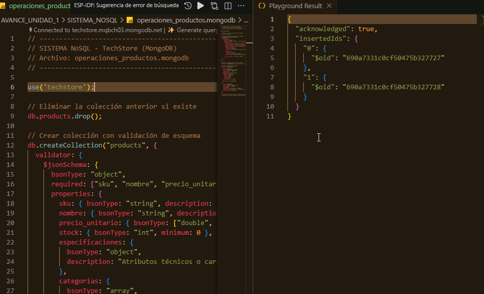
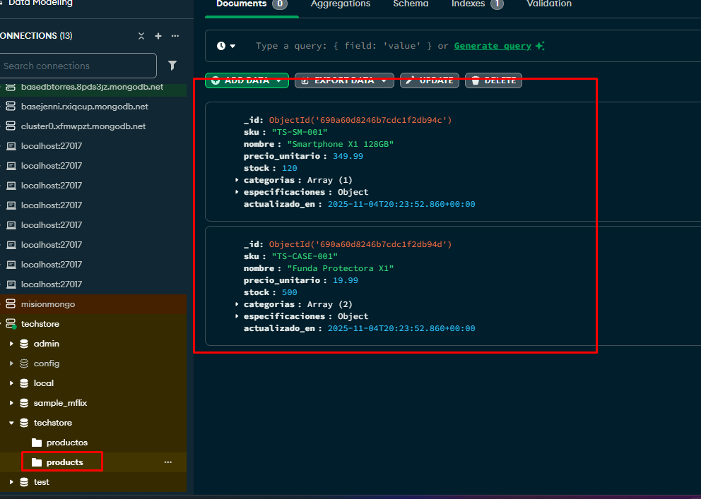
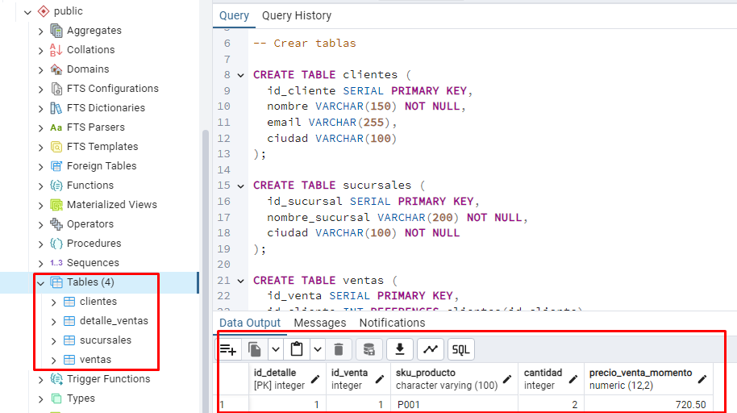
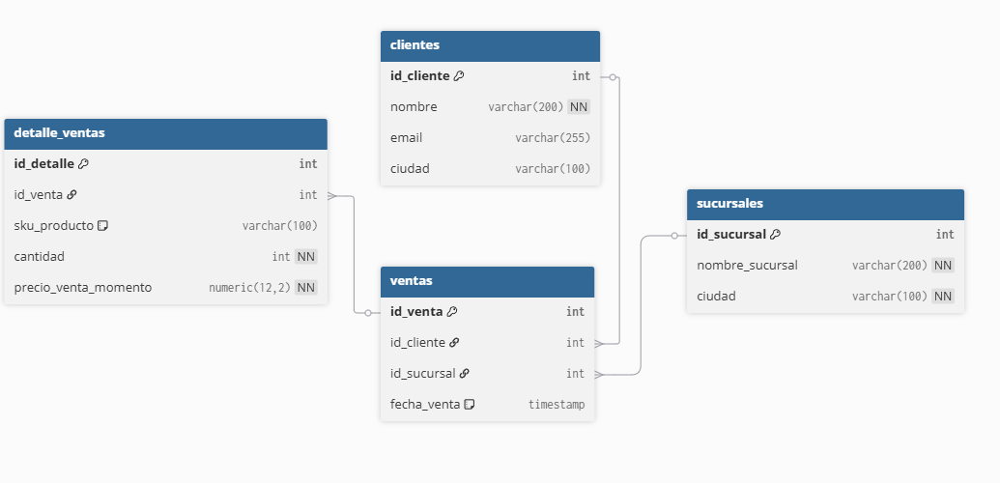

# INFORME_U1 — Avance 1
## Proyecto Macro: TechStore - Solución de Business Intelligence
### Nombre : Jennifer Torres

### 1. Justificación del Modelo Dual (SQL + NoSQL)
TechStore combina dos necesidades:
- **SQL (PostgreSQL)**: se usa para manejar ventas, clientes y sucursales porque requiere integridad, consistencia y relaciones claras (ACID).
- **NoSQL (MongoDB)**: se usa para el catálogo de productos, donde las especificaciones cambian mucho (smartphones, fundas, laptops, etc.). MongoDB permite documentos flexibles y mejor adaptación al cambio.

En conjunto, ambos sistemas soportan la operación diaria y luego servirán como base para el futuro **Data Mart de Ventas**.

---

### 2. Diseño de los sistemas
**MongoDB (techstore_inventory):**  
Colección `products` con campos:  
`sku`, `nombre`, `precio_unitario`, `stock`, `categorias`, `especificaciones`.

**PostgreSQL (techstore_sales):**  
Tablas:  
- `clientes`
- `sucursales`
- `ventas`
- `detalle_ventas`

Relación principal:  
`detalle_ventas.sku_producto` conecta con `products.sku` de MongoDB.

---

### 3. Problemas potenciales de calidad de datos
| Nº | Problema | Impacto | Solución Propuesta |
|----|-----------|----------|--------------------|
| 1 | SKU inexistente en MongoDB | Ventas con productos no válidos | Validar en el proceso ETL antes de cargar al Data Mart |
| 2 | Duplicados de SKU en MongoDB | Datos inconsistentes | Crear índice único `{ sku: 1, unique: true }` |
| 3 | Emails nulos o mal formateados en clientes | Dificulta análisis de clientes | Validar formato y usar `CHECK` o scripts de limpieza |

---
### 4. Resultados 
 1. Sistema NoSQL – MongoDB 
 Explicación: En esta imagen se muestra la creación de la base de datos techstore_inventory y la inserción de varios documentos en la colección productos. Cada producto incluye campos estructurados (sku, nombre, precio_unitario, stock) y un documento anidado “especificaciones” que demuestra la flexibilidad de MongoDB.

2. Consulta db.productos.find().pretty() mostrando los productos almacenados.
 Explicación: Aquí se observa cómo MongoDB permite manejar diferentes estructuras dentro de la misma colección.
Por ejemplo, algunos productos pueden tener atributos adicionales como “color”, “marca” o “memoria”, sin que sea necesario modificar un esquema rígido.

3. Sistema Relacional – PostgreSQL
Explicación:
Se muestra la creación correcta de las tablas clientes, sucursales, ventas y detalle_ventas, junto con sus llaves primarias y foráneas.
Esto garantiza la integridad referencial del sistema relacional.

4. Vista del modelo Entidad-Relación (modelo_relacional_ventas.png).

Explicación:
Este diagrama representa cómo se relacionan las entidades del sistema transaccional (OLTP).
Por ejemplo:

    * Un cliente puede tener muchas ventas.

    * Cada venta pertenece a una sucursal.

    * Cada venta tiene varios detalles con los productos vendidos.*

---
### 4. Conclusión
El uso de **SQL y NoSQL** permite combinar consistencia transaccional con flexibilidad estructural.  
Este primer avance define las bases para construir un **Data Mart de Ventas** limpio, confiable y escalable.  
El éxito de la inteligencia de negocio dependerá de mantener una **buena calidad de datos** en ambos sistemas OLTP.

